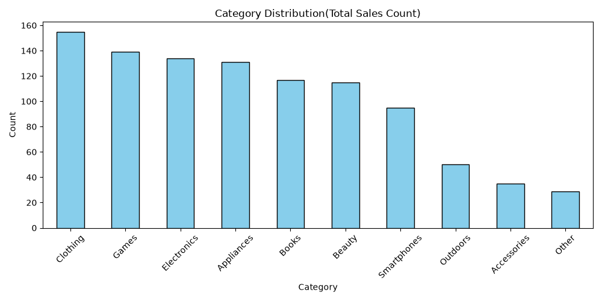
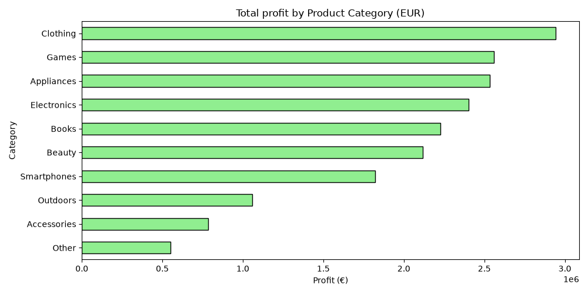
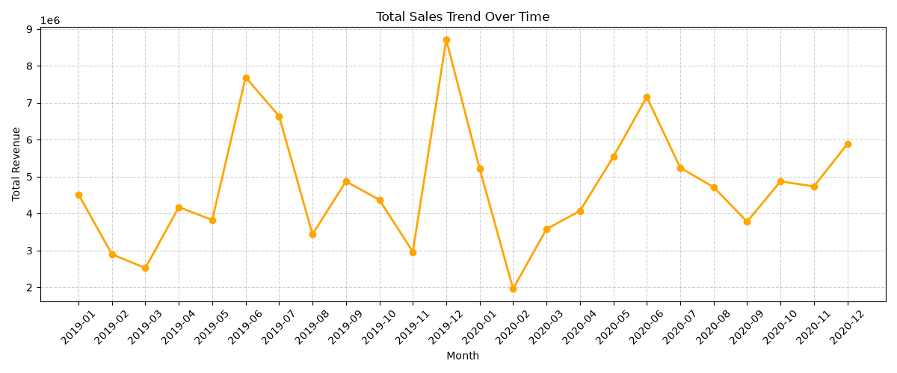
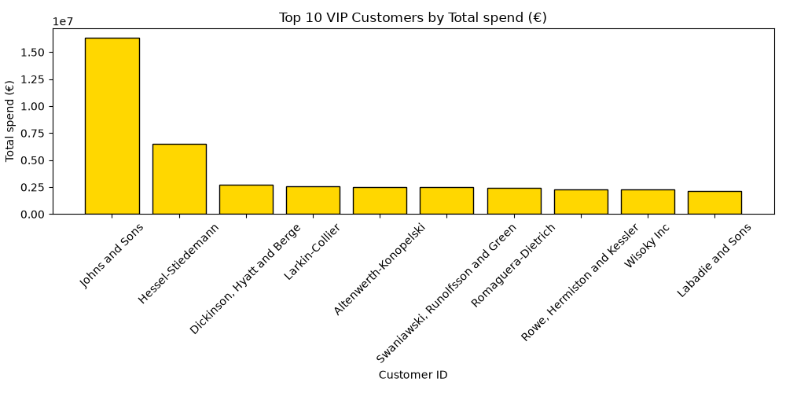

# 📈 Retail Sales, Profit Margin, & Customer Lifetime Value Analysis

## 📌 Executive Summary
This project outlines an end-to-end data analysis and feature engineering pipeline using a two-year retail dataset (2019-2020). The objective was to transform raw, text-heavy financial data into actionable corporate intelligence. By resolving structural data anomalies, implementing behavioral feature engineering, and constructing advanced data visualizations, this pipeline exposes key profit drivers, seasonal demand curves, and high-value customer segments.

---

## 🔍 Key Business Insights

### 1. Product Performance & Profitability
* **The Revenue Engine:** **Clothing** is the core operational driver, securing the highest transaction volume and netting **€2,941,938.09** in absolute profit.
* **The Volume vs. Value Trap:** While *Electronics* registers a higher individual transaction count than *Appliances*, **Appliances** outpaces it in actual profitability, delivering **€2,534,879.34** in pure profit.
* **Strategic Mandate:** Reallocate low-margin marketing budgets from Electronics to high-margin Appliance segments to maximize capital efficiency.

### 2. Seasonality & Time-Series Trends
* **Holiday Peaks:** Operational revenue experiences a massive annual surge in **December** (approaching €8.7M in 2019), demonstrating an intense reliance on Q4 consumer shopping patterns.
* **The Mid-Year Surge:** A predictable secondary revenue spike consistently surfaces every **June**.
* **The Q1 Operational Slump:** Sales numbers bottom out drastically every **February**, marking the lowest revenue period of the fiscal year.
* **Strategic Mandate:** Deploy aggressive inventory clearance strategies in January to mitigate the February downturn, and optimize supply chain fulfillment by mid-May to capture the June surge.

### 3. Customer Behavior & VIP Metrics (New Feature)
* **High-Value Client Identification:** By engineering specialized behavioral features, the system successfully aggregates total order frequencies and cumulative lifetime spend per client.
* **Retention Strategy:** Identifying the **Top 10 VIP Customers** allows the business to transition from generic marketing to high-retention VIP loyalty campaigns, safeguarding the core revenue base.

---

## 📊 Visual Dashboards

### 1. Sales Volume vs. Absolute Profit
The comparison below highlights that inventory sales volume does not automatically correlate to financial return, as proven by the profit dominance of Appliances over Electronics.

| Transaction Volume Breakdown | Total Net Profit by Category |
| :---: | :---: |
|  |  |

---

### 2. Macro Timeline Trends & VIP Concentration
The time-series line chart tracks the monthly macroeconomic trajectory, while the gold bar chart isolates the fiscal contribution of the brand's top 10 individual consumers.

#### 📈 Total Sales Trend Over Time

#### 🏆 Top 10 VIP Customers by Total Spend

---

## 🛠️ Technical Stack & Data Engineering Pipeline

* **Python 3.x:** Core pipeline architecture.
* **Pandas Data Cleaning:** Sanitized text-heavy columns, executed regex modifications to remove currency symbols (`€`, `$`) and formatting strings (`,`), and optimized data structures using `pd.to_numeric` and `pd.to_datetime`.
* **Feature Engineering:** Developed custom business metrics including absolute profit equations, percentage margin distributions, and historical customer spend matrices.
* **Data Aggregation & Merging:** Leveraged nested list comprehensions for dynamic column hunting alongside relational `groupby` manipulations and `pd.merge(how='left')` structures.
* **Matplotlib Visualization:** Generated multi-axis categorical bar charts, horizontal charts, time-series line graphs, and customized color pallets (`skyblue`, `lightgreen`, `gold`).
